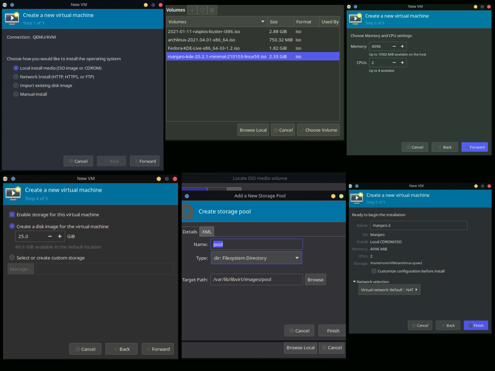

# Create a virtualisation environment using KVM/Xen/HyperV/Virtualbox. 
# Setup a network of two or more virtual machines.

## Checking support for KVM
```bash
$ LC_ALL=C lscpu | grep Virtualization
```

Alternatively:

```bash
$ grep -E --color=auto 'vmx|svm|0xc0f' /proc/cpuinfo
```

If nothing is displayed after running either command, then your processor does
 not support hardware virtualization,nand you will not be able to use KVM.

> Note: You may need to enable virtualization support in your BIOS. All 
> x86_64 processors manufactured by AMD and Intel in the last 10 years support
>  virtualization. If it looks like your processor does not support 
> virtualization, it's almost certainly turned off in the BIOS.

### Steps for enabling Virtualization(varies by vendor, example follows an ASUS
### laptop which I currently use)
- Press ```F2``` when powering on.
- Press ```F7``` to enter Advanced Mode.
- Navigate to ```Advanced``` tab.
- Expand ```CPU Configuration```.
- Enable ```SVM```.
- Press ```F10``` to save & exit.

## Kernel Support
I use Manjaro Linux, a derivative of Arch Linux which provides the necessary 
modules to support KVM, this applies 
to Debian and RHEL based distributions as well.

- One can check if the necessary modules, ```kvm``` and either ```kvm_amd``` or
-  ```kvm_intel```, are available in
   the kernel with the following command:

```bash
$ zgrep CONFIG_KVM /proc/config.gz
```

The module is available if all the configuration parameters are set to either
 ```y``` or ```m```.

- Then ensure the kernel modules are loaded with the following command:
```bash
$ lsmod | grep kvm
```

## How to use KVM
To use KVM, we need an emulator. We use QEMU.

### Installation
> Installation was performed on Manjaro Linux running ```5.11.10-1-MANJARO```

Install virt-manager, qemu and all dependencies:

```bash
pacman -S virt-manager qemu vde2 ebtables dnsmasq bridge-utils openbsd-netcat
```

Enable and start the service:

```bash
systemctl enable libvirtd.service
systemctl start libvirtd.service
```


### Usage
- Launch ```virt-manager```
  #### Creating a VM:
  1. Choose ```New Virtual Machine``` from the ```File``` menu.
  2. Choose the installation media type.
  3. Browse for the installation media.
  4. Allocate CPU and Memory to the VM.
  5. Enable storage and choose the size of disk image for the VM.
  6. On the last page, review your settings. Hit ```Finish``` when ready.
- The VM will be provisioned and started with the installation media. You may 
then proceed with OS installation.



#### Post-installation
```bash
# Enable ssh and getty services
systemctl enable --now sshd
systemctl enable --now getty@ttyS0
```

### Useful commands
```bash
# commands to start, shutdown a VM, list network details, access the 
# terminal(tty), list all VMs given in order
virsh start vm_name
virsh shutdown vm_name
virsh domifaddr vm_name
virsh console vm_name
virsh list --all
```

## Networking
Libvird, creates a virtual bridged network for the VMs by default, so no further
configuration is needed.

### Sharing data between host and guest
Files can be shared between guest and host by using
```sshfs``` as follows:

```bash
sshfs vm-name@192.168.122.188:remote-path host/mount/point
# for example
sshfs manjarokvm1@192.168.122.188:/home/manjarokvm1 ~/VMShareDir/manjaro
```

Unmounting can be done via ```fusermount```
```bash
fusermount -u host/mount/point
# for example
fusermount -u VMShareDir/manjaro
```

### Sharing data between guests
```ssh, sftp, ftp``` can be used for sharing data between guests. Here, we
explore SFTP. Here we assume that two guests are running, and their IP addresses
are known using ```virsh domifaddr vm-name``` command, and that we are in the
respective consoles of the guests accessed using ```virsh console vm-name```.

To start an SFTP connection:

```sftp user@ip-of-other-guest```

Enter the password and proceed to the ```sftp``` cli. From this step all the 
commands are given within the ```sftp``` cli.

```bash
# downloads the file VM.mp4 to our VM, and places it in $PWD
sftp> get VM.mp4
# uploads the file to the other VM
sftp> put lin.out
# closes the connection
sftp> bye
```