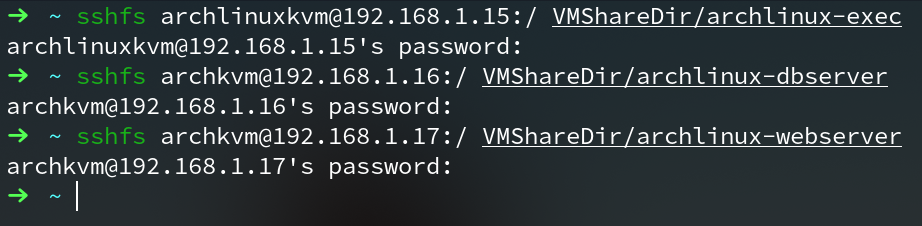
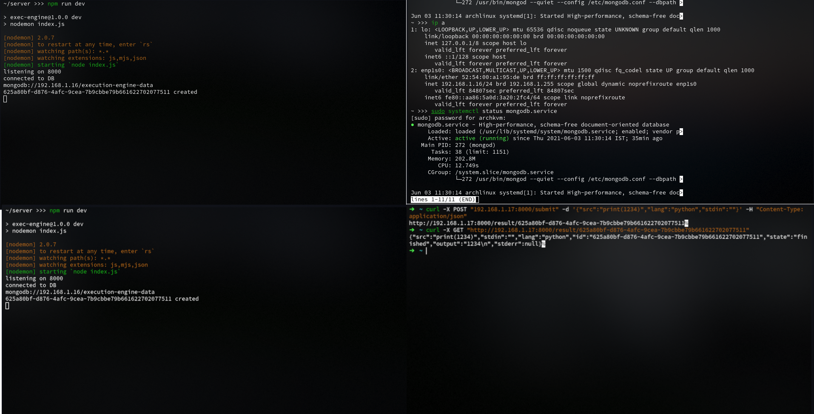
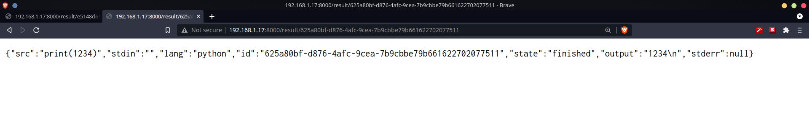
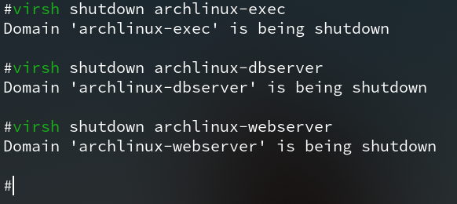

# Cloud Broker Service - Create a virtualisation environment using KVM/Xen/HyperV/Virtualbox. Write a program to create a cloud broker service provider that offers the “program compiler” service from one CSP.

## Network Setup
The default network setup my librirt creates a NAT network which is only visible
to the host, but not the network. To change the default network configuration,
we create a bridge to bypass the NAT and connect directly to the intended network.
The steps for creating a bridge vary vastly, the following guide assumes
```NetworkManager``` daemon to be the top level network configuration manager
and assumes ```nmtui``` to be installed and all the steps mentioned are to be
done within ```nmtui``` additionally, these steps create a bridged network for
an ```Ethernet``` slave.

### Steps for creating a bridge
1. Choose ```Edit a connection```.
2. Delete preexisting wired profiles.
3. Select ```Add``` option.
4. Choose connection type as ```Bridge```
5. Type an appropriate ```Profile name``` as well as ```Device``` label ensure
   that both of them are identical.
6. In the ```Slaves``` section, add a new slave:
   1. choose ```Add``` and select the type as ```Ethernet```(or whichever applicable).
   2. Give an appropriate ```Profile Name``` and type the desired slave inferface MAC address.
   3. Make sure ```Available to all users``` is checked.
   4. Choose ```OK```
7.  Leave ```IPv4 CONFIGURATION``` and ```IPv6 CONFIGURATION``` as ```Automatic```.
8.  Make sure ```Available to all users``` is checked.
9.  Choose ```OK```.

> Make sure to use the newly created bridge instead of the default NAT when
> creating a VM

## Server specification
For this exercise both database as well as web server uses ```Arch Linux``` with
a single core and 1GB RAM. For web server ```nodejs``` was used and ```mongodb```
was the chosen database.

## Server Setup
The below setup was done on an Arch Linux installation.
- ### Web Server
  - Install ```nodejs```, ```git``` and ```npm```.
     ```bash
     pacman -S nodejs npm git
     ```

- ### Database Server
  1. Install [```mongodb-bin```](https://aur.archlinux.org/packages/mongodb-bin/)
     from the [AUR](https://aur.archlinux.org/)(AUR is applicable only for Arch
     Linux and derivatives).
  2. Enable the mongodb daemon.
     ```bash
     systemctl enable --now mongodb.service
     ```
## Runner Node Specification
The runner is also an ```Arch Linux``` installation with the following specifications:
- 4 CPU cores
- 8 GB RAM
- 20 GB Storage
- ### Setup
- Install ```nodejs``` and ```npm``` as instructed [above](#server-setup)

## Copying program source code to VMs
The source code was copied to the VMs using ```sshfs``` as described in 
[```previous question```](../question_1/question_1.pdf) and also depicted below.


## Brief of the deployed application
A RESTful API was deployed using the ```Web Server```, ```Database Server``` and
 the ```Runner Node```. The ```Web Server``` listens on port ```8000``` on route
  ```POST/submit``` expecting a ```JSON``` document of the following format:
```json
{
    "src": "source code",
    "lang": "language, currently supported are c++, python, nodejs",
    "stdin": "input to the program if any, otherwise left blank"
}
```

On recieving a request for a job, the server makes a database entry with the supplied data and responds with a URL while handing off the work to ```Runner Node```
The URL is of the form: ```host:port/result/id```

This URL can be used to fetch results or check the status of the job.

The server also listens on route ```GET/result/:id``` to process requests for 
results. It simply returns a ```JSON``` of the following format:
```json
{
    "src": "source code",
    "stdin": "given input, if any",
    "lang": "language",
    "id": "a request ID",
    "state": "waiting if not complete, finished otherwise",
    "output": "stdout from the program, if any",
    "stderr": "stderr from the program, if any"
}
```
## Testing

The deployed web application was tested by accessing it from the host OS, a 
sample ```python``` program was given for testing.




## Shutting down the VMs
The VMs were shutdown after usage using ```virsh``` as mentioned in 
[```previous question```](../question_1/question_1.pdf) and also depicted below.


