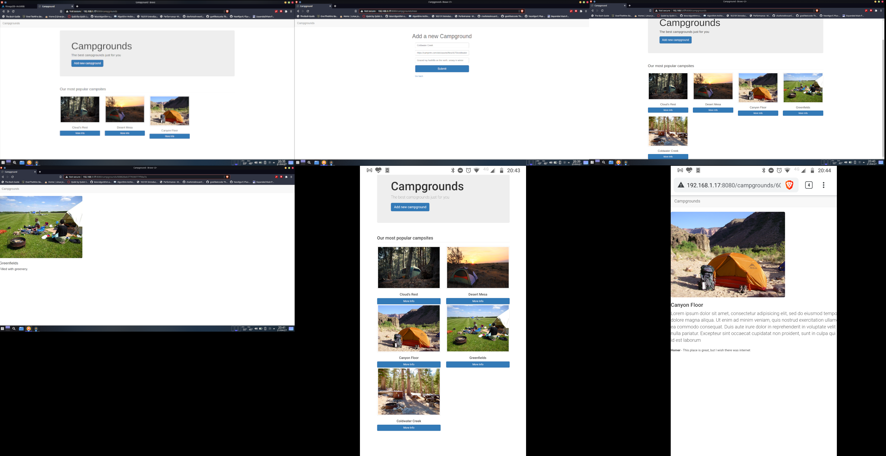

# Three Node VM - Install three servers using Xen / KVM hypervisor. Use two of them to install any application server (Apache etc) and any database server (MySQL etc). Create an application (say a simple login) on the third using the other two servers. Access the application from your host OS and another system.

## Network Setup
The default network setup my librirt creates a NAT network which is only visible
to the host, but not the network. To change the default network configuration,
we create a bridge to bypass the NAT and connect directly to the intended network.
The steps for creating a bridge vary vastly, the following guide assumes
```NetworkManager``` daemon to be the top level network configuration manager
and assumes ```nmtui``` to be installed and all the steps mentioned are to be
done within ```nmtui``` additionally, these steps create a bridged network for
an ```Ethernet``` slave.

### Steps for creating a bridge
1. Choose ```Edit a connection```.
2. Delete preexisting wired profiles.
3. Select ```Add``` option.
4. Choose connection type as ```Bridge```
5. Type an appropriate ```Profile name``` as well as ```Device``` label ensure
   that both of them are identical.
6. In the ```Slaves``` section, add a new slave:
   1. choose ```Add``` and select the type as ```Ethernet```(or whichever applicable).
   2. Give an appropriate ```Profile Name``` and type the desired slave inferface MAC address.
   3. Make sure ```Available to all users``` is checked.
   4. Choose ```OK```
7.  Leave ```IPv4 CONFIGURATION``` and ```IPv6 CONFIGURATION``` as ```Automatic```.
8.  Make sure ```Available to all users``` is checked.
9.  Choose ```OK```.

> Make sure to use the newly created bridge instead of the default NAT when
> creating a VM

## Server specification
For this exercise both database as well as web server uses ```Arch Linux``` with
a single core and 1GB RAM. For web server ```nodejs``` was used and ```mongodb```
was the chosen database.

## Server Setup
The below setup was done on an Arch Linux installation.
- ### Web Server
  1. Install ```nodejs```, ```git``` and ```npm```.
     ```bash
     pacman -S nodejs npm git
     ```
  2. Clone project files.
     ```bash
     git clone path-to-repository
     ```
  3. Navigate to the project's root directory and install dependencies.
     ```bash
     npm install
     ```
  4. Start the server.
     ```bash
     npm run start
     ```

- ### Database Server
  1. Install [```mongodb-bin```](https://aur.archlinux.org/packages/mongodb-bin/)
     from the [AUR](https://aur.archlinux.org/)(AUR is applicable only for Arch
     Linux and derivatives).
  2. Enable the mongodb daemon.
     ```bash
     systemctl enable --now mongodb.service
     ```

## Brief of the deployed application
A web application was deployed using this setup. The application currently can
store records of campgrounds where each record consists of an image URL, body 
and a title. This data is persisted in a database. The server hosts a RESTful API
which can be used to browse preexisting records or add a new record.

## Testing

The deployed web application was tested by accessing it from the host OS as well as from a mobile device connected to the same network. Two new records were added apart from the initial seeding data.

