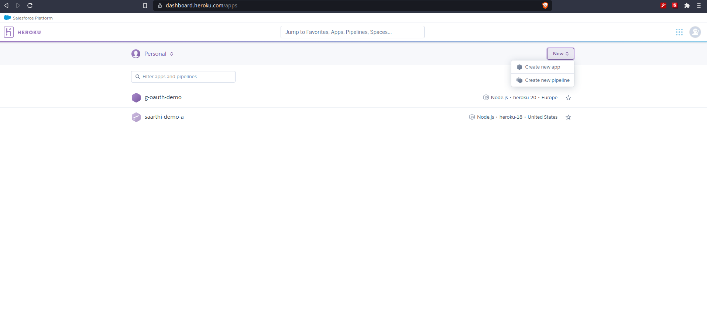
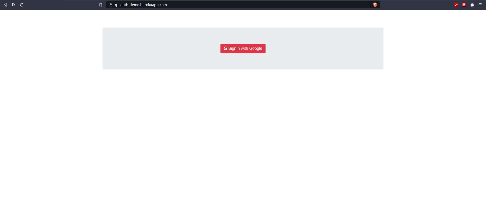
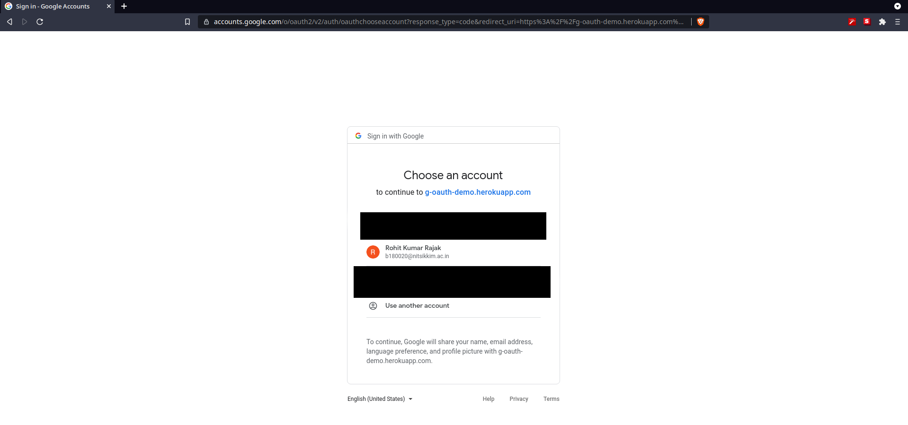
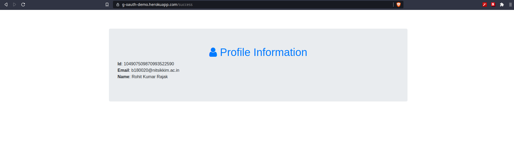

# Create a Virtual machine in Google cloud/ Amazon cloud. Using google App Engine create an interface to interact with google services with valid credentials.

## Setup

### Google API Keys
Google API key and client ID for a ```web application``` was created via [Google Cloud Console](https://console.cloud.google.com/).

1. Go to the [API Console](https://console.developers.google.com/)
2. From the projects list, select a project or create a new one.
3. If the APIs & services page isn't already open, open the left side menu and select APIs & services.
4. On the left, choose Credentials.
5. Click Create credentials and then select API key.

### Google Client ID
1. Open the Credentials page of the Google APIs console.
2. Create or select a Google APIs project. If you already have a project for the Sign In With Google button or Google One Tap, use the existing project and the web client ID.

3. If your project doesn't have a Web application-type client ID, click Create credentials > OAuth client ID to create one. Be sure to include your site's domain in the Authorized JavaScript origins box. Please note that Google One Tap can only be displayed in HTTPS domains. When you perform local tests or development, you must add both ```http://localhost``` and ```http://localhost:<port_number>``` to the Authorized JavaScript origins box.

### OAuth Consent Screen
1. Open the OAuth consent screen page of the Google APIs console.
2. If prompted, select the project you just created.
3. On the ```OAuth consent screen``` page, fill out the form and click the ```Save``` button.

4. Application name: The name of the application asking for consent. The name should accurately reflect your application and be consistent with the application name users see elsewhere. The application name will be shown on the One-tap dialog window.

5. Support email: Shown on the consent screen for user support and to G Suite administrators evaluating access to your application for their users. This email address will be shown to users on the Sign In With Google consent screen when the user clicks the application name.

6. Scopes for Google APIs: Scopes allow your application to access your user's private Google data. For the authentication, default scope (email, profile, openid) is sufficient, you don’t need to add any sensitive scopes. It is generally a best practice to request scopes incrementally, at the time access is required, rather than up front. Learn more.

> Optional:
>
> 7. Application logo: An image on the consent screen that will help users recognize your app. The logo is shown on Sign In With Google consent screen and on account settings, whereas it’s not shown on One Tap dialog.
>
> 8. Authorized domains: To protect you and your users, Google only allows applications that authenticate using OAuth to use Authorized Domains. Your applications' links must be hosted on Authorized Domains. Learn more.
>
>9. Application Homepage link: Shown on Sign In With Google consent screen and One-Tap GDPR complaint disclaimer information under the “Continue as” button. Must be hosted on an Authorized Domain.
>
>10. Application Privacy Policy link: Shown on Sign In With Google consent screen and One-Tap GDPR complaint disclaimer information under the “Continue as” button. Must be hosted on an Authorized Domain.
>
>11. Application Terms of Service link (Optional): Shown on Sign In With Google consent screen and One-Tap GDPR complaint disclaimer information under the “Continue as” button. Must be hosted on an Authorized Domain.
>
>Check "Verification Status", if your application needs verification then click the "Submit For Verification" button to submit your application for verification. Refer to OAuth verification requirements for details.

> Unverified applications can only login test accounts. Verification can take weeks, but is recommended.


### GitHub
To deploy a web application, a [GitHub](https://github.com) account is advisable.
Head over to either of these websites and signup for an account. Create a repository for the project and ```push``` the source code.

### Heroku
Here, we use [Heroku](https://heroku.com), as it offers a free tier and doesn't require a credit card unlike AWS and GCP.
We create a ```Heroku``` account and link it with our ```GitHub``` account.

#### Creating a new app
- On the dashboard, click on ```New | Create a new app```.
- Give a suitable name and select a region.
- Click ```Create app```
- Click on ```Connec to to GitHub``` and fill in the ```repo-name```, click search, click connect.
- Optionally enable autommatic deploy for the preferred branch.
- Navigate to ```settings``` tab, go to ```Config Vars``` section and click ```Reveal Config Vars``` and add
  the required variables.
- Click ```Deploy Branch``` to deploy the application.


## Brief of the application
The deployed application logs in a user using Google's OAuth servers and displays basic account information.



