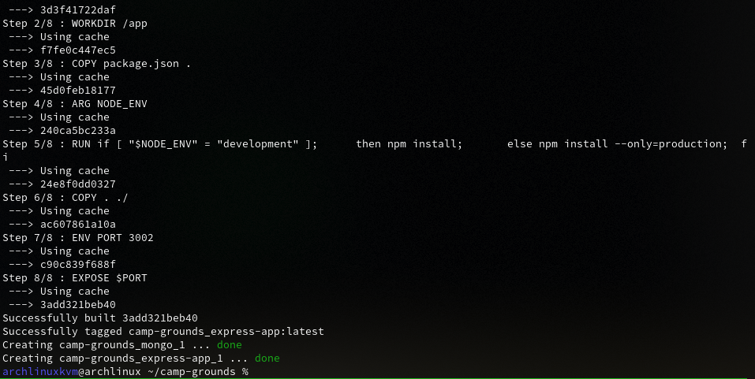
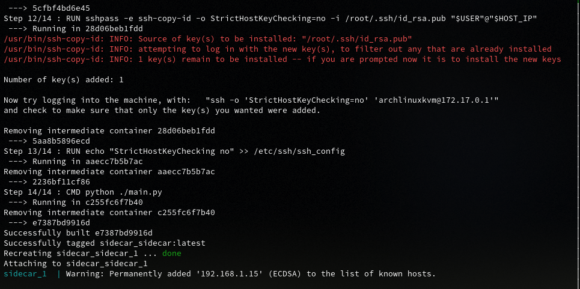
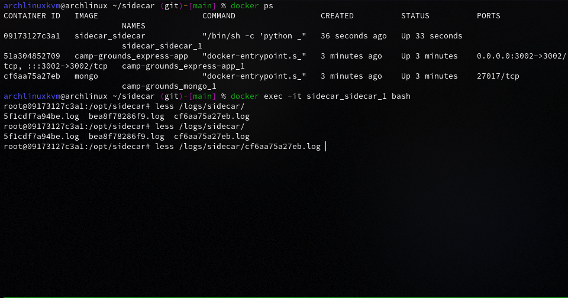
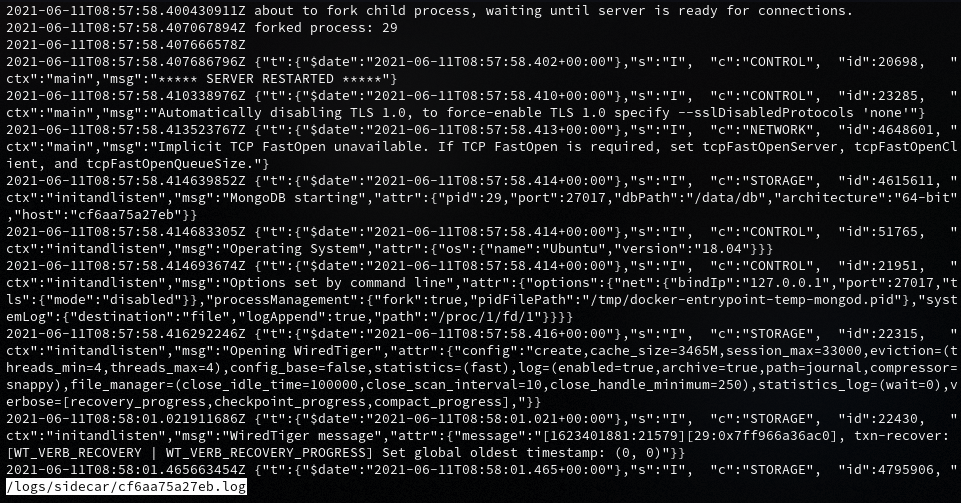
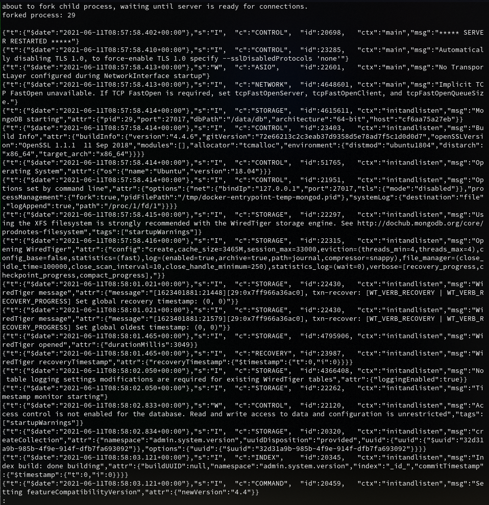

# Setup a container environment using Docker. Write a program to create a log-based container for running objects.

## Setup
## Installing Docker
Owing to it's popularity, ```Docker``` is usually present in the official 
repositories of Linux distributions. We also use ```docker-compose``` which facilitates 
working with multiple containers In this case, an ```Arch Linux``` host was 
used, so the following instructions assume either an Arch Linux host or it's 
derivatives.

We install [```Docker```](https://www.docker.com/get-started) and 
[```Docker Compose```](https://docs.docker.com/compose/) by invoking our package manager.

```bash
pacman -S docker docker-compose
```

To use docker and related commands without privilege escalation, we add our user 
to the ```docker``` group, enable the docker daemon and restart our session.

```bash
usermod -aG docker user-name
systemctl enable --now docker.service
```

## Brief of the logging container
Docker's [```python``` SDK](https://docs.docker.com/engine/api/sdk/) was used to 
develop this program. The program expects a configuration file which specifies the
user that runs the docker daemon on the host and the id of the container. The docker
SDK uses ```ssh``` to connect to the host and then connects to the docker daemon.
Logs from the given container are streamed into a buffer and all the control characters and 
terminal colour formatting is stripped and are written to ```/logs/sidecar/container-id```.
```/logs``` is mounted as a named volume ```log-data``` to persist the data on 
running ```docker-compose down``` to tear down the container.
This program uses a sidecar approach where a container is given it's own logger. 
This avoids having a single point of failure. However, still, some manual configuration 
is needed before using this logging container. This is intentional and allows for 
flexibility and customizability.

## Configuration
The program expects a config.json in the source directory housing the following 
information.
```json
{
  "host": "the user with access to the docker daemon on the host machine",
  "ip": "IP address of the host",
  "id": "id of the running container to be logged"
}
```
To setup passwordless ```ssh``` for the ```Docker SDK``` we require the following
build-time arguments.

```bash
USER=username_with_access_to_docker_daemon
SSHPASS=password_for_USER_needed_for_passwordless_ssh_setup
HOST_IP=172.17.0.1_by_default_should_be_overridden_if_the_logging_container_is_not_on_default_network
```
## Testing
To test the container, it was made to log a ```mongo``` container running on the 
host machine.



The logger was started with the appropriate configuration to target the ```mongo``` 
container.


Logs were examined using ```docker exec```.

Logs are recorded as ```<timestamp> <log-entry>```

Original logs using ```docker logs``` command is shown below:


## Teardown
To teardown the container ```docker-compose down``` can be used.

# References
- [Docker<sup>Arch-Wiki</sup>](https://wiki.archlinux.org/title/Docker)
- [Docker<sup>docker-docs</sup>](https://docs.docker.com/)
- [Docker logs format<sup>ahmet</sup>](https://ahmet.im/blog/docker-logs-api-binary-format-explained/)
- [Removing ANSI escape sequences<sup>stackoverflow</sup>](https://stackoverflow.com/questions/14693701/how-can-i-remove-the-ansi-escape-sequences-from-a-string-in-python)
- [Removing control characters<sup>stackoverflow<sup>](https://stackoverflow.com/questions/92438/stripping-non-printable-characters-from-a-string-in-python)